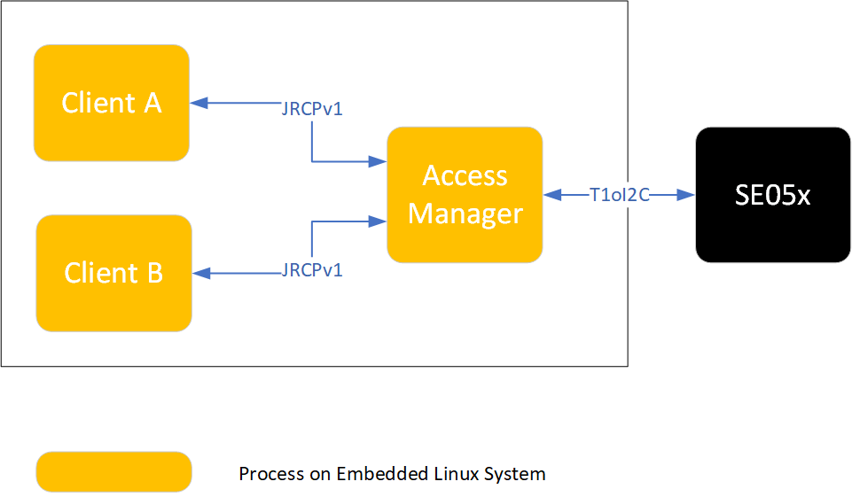

..
    Copyright 2020 NXP

.. _accessManager:

========================================================================================
 Access Manager: Manage access from multiple (Linux) processes to an SE05x IoT Applet
========================================================================================

- DocRevision : 0.93
- Date        : 2020-10-20

Summary
========================================================

The Access Manager supports concurrent access from multiple linux processes to an
SE05x IoT applet.
The Access Manager can establish a connection to the SE05x either as a plain connection
or as an SCP03 platform connection.
Client processes connect over the JRCPv1 protocol to the accessManager.
Refer to :ref:`accessManager-concepts` for more details.

.. note::
    When using multiple clients with user authentication, build client applications
    with  ``-DSMCOM:STRING=JRCP_V1_AM`` option.
    This will ensure the user session is established in an atomic way per client connect.

.. _accessManager-usage:

Usage
========================================================

::

  The accessManager takes two optional arguments 'plain' & 'any'
          'accessManager':
                  Platform SCP03: ON.
                  Incoming connection: localhost.
          'accessManager plain':
                  Platform SCP03: OFF.
                  Incoming connection: localhost.
          'accessManager any':
                  Platform SCP03: ON.
                  Incoming connection: any supported address.
          'accessManager plain any':
                  Platform SCP03: OFF.
                  Incoming connection: any supported address.

  Note:
          Product Deployment => Enable Platform SCP03 & restrict incoming connection to localhost

In case STREAM sockets are used (currently the only socket type supported) client processes must connect
to port 8040.

As an example:

- The Access Manager is running on iMX and opens a listening STREAMING socket. Incoming connections can be restricted
  to client processes connecting over localhost.

  Example invocation. Notice that the Platform SCP03 keys are passed through an environment variable::

    root@imx8mqevk:~/mnt/git/simw-top_build_imx8_5_4_24/imx_native_se050_t1oi2c# \
      EX_SSS_BOOT_SCP03_PATH=/home/root/plain_scp03.txt bin/accessManager
    Starting accessManager (Rev.0.9).
      Protect Link between accessManager and SE: YES.
    accessManager JRCPv1 (T1oI2C SE side)
    ******************************************************************************
    Server: waiting for connections on port 8040.
    Server: only localhost based processes can connect.

- client process connects via JRCPv1 to 127.0.0.1:8040

  Example invocation. Notice that the server address is set through an environment variable.
  In a product deployment the default server:port address can also be hard-coded to the proper value::

    root@imx8mqevk:~/home/root# EX_SSS_BOOT_SSS_PORT=127.0.0.1:8040 se05x_ConcurrentEcc

.. _accessManager-build:

Build
========================================================

- The Access Manager must be built as a statically linked executable as its communication and authentication layer is different from
  the client processes that connect to it.

- Access manager will send "READY=1" start up notification to service manager. This is disabled by default. To enable, uncomment below lines in ``simw-top/hostlib/hostLib/accessManager/CMakeLists.txt`` file ::

    ADD_DEFINITIONS(-DENABLE_SD_NOTIFY)
    TARGET_LINK_LIBRARIES(${PROJECT_NAME} systemd)

  .. note::
      To build access manager on RaspberryPi with `ENABLE_SD_NOTIFY` enabled, install systemd-dev lib as
      ``sudo apt-get install libsystemd-dev``

  Build settings to support access to SE05x on iMX host platform (to be applied on top of a configured host build area)::

    cmake -DSCP:STRING=SCP03_SSS -DSE05X_Auth:STRING=PlatfSCP03 -DSMCOM:STRING=T1oI2C \
      -DWithSharedLIB:BOOL=OFF -DPAHO_BUILD_SHARED:BOOL=FALSE -DPAHO_BUILD_STATIC:BOOL=TRUE .
    cmake --build . --target accessManager

- The client processes that connect to the Access Manager must be built in a separate build environment.
  All session authentication mechanisms are supported, platform SCP03 must be off (platform SCP03 is handled by the Access Manager).

  Build settings for client processes connecting via Access Manager, in the example no session authentication is used (to be applied on top of a configured host build area)::

    cmake -DSE05X_Auth:STRING=None -DSMCOM:STRING=JRCP_V1 .
    cmake --build .

Demo: concurrent access from 2 processes using OpenSSL engine
==============================================================

- The example requires an embedded Linux platform (e.g. an iMX8) with an attached SE05X. Interaction with the iMX8 is over 3 different
  shells. These shells can e.g. be established via ssh from a PC on the same network.

- Build the Access Manager in a dedicated workarea, follow build instructions as above. Select static linking, enable Platform SCP03
  and use T1oI2C as communication protocol.

- Build the Plug&Trust package in a dedicated workarea, follow build instructions as above. Select None as authentication mode and
  use JRCPv1 as communication protocol.

- Start the Access Manager from a dedicated shell (to simplify the demo, Platform SCP03 is not enabled)::

    ./accessManager plain

- Open another shell and configure the attached Secure Element once using the ssscli tool
  (ensure the installed ssscli tool uses JCRPv1 as communication protocol, refer to :ref:`ssscli-interface`)::

    cd <plug_and_trust>/simw-top/sss/plugin/openssl/scripts
    python3 openssl_provisionEC.py --key_type prime256v1 --connection_data 127.0.0.1:8040

- From the same shell invoke the OpenSSL Engine to perform various sign/verify operations using the provisioned EC key pairs::

    python3 openssl_EccSign.py --key_type prime256v1 --connection_data 127.0.0.1:8040

- Open another shell and invoke the OpenSSL Engine to perform various sign/verify operations using the provisioned EC key pairs::

    cd <plug_and_trust>/simw-top/sss/plugin/openssl/scripts
    python3 openssl_EccSign.py --key_type prime256v1 --connection_data 127.0.0.1:8040  --output_dirname output3

- The respective 'openssl_EccSign.py' invocations can be repeated, ensure both process invocations run in parallel.

Example programs prepared for concurrent access
================================================

The demo folder of the Plug&Trust MW package contains two SSS API based example programs that are compatible with concurrent access
requirements like:

- ability to select a specific (optional) authentication object ID

- provisioned content of secure element is not erased at project start-up

For more details on these examples refer to:

- :numref:`se05x_ConcurrentEcc` :ref:`se05x_ConcurrentEcc`

- :numref:`se05x_ConcurrentSymm` :ref:`se05x_ConcurrentSymm`

.. _accessManager-concepts:

Concepts & Features
=========================

- The Access Manager uses plain communication or platform SCP03 in the communication with the SE. Select the mode at start-up.

- Client processes connect to the accessManager using the JRCPv1 protocol

- The user session authentication type is determined at the client build time.
  User session authentication is transparent to the Access Manager.

- The Access Manager ensures APDU command / response pairs associated with a client process are executed without interference
  from another client process.

- The Access Manager does not connect to the SE05x at start up. It waits until a client process initiates a connection.

- When a client process selects the SE05x IoT applet the applet response is
  cached by the Access Manager, a subsequent SE05x IoT applet select by a client process will simply return the cached
  applet response.

- A card manager select command is intercepted by the Access Manager and a pre-cooked response is provided to the
  initiating client process. No interaction with the secure element takes place.

The following figure illustrates the Access Manager is an independent process on the Embedded System
providing indirect access to the Secure Element for client processes.

The following sequence diagram illustrates two processes connecting through the Access Manager to the Secure Element.

.. image:: 0010_2clients_none.png

Restrictions
====================

- Each user session needs to have a different authentication object; i.e. one Authentication Object
  cannot be used to open multiple sessions in parallel. This limitation is inherent to the SE05x user
  session concept.

- The SE05x does not support more than two active user sessions (based upon either a User ID, AES Key or EC Key
  authentication object). The Access Manager does not and - conceptually - cannot monitor the number of active user sessions.

- The Access Manager only supports concurrent access to the SE05x IoT applet. Do not access
  other applets than the SE05x applet through the Access Manager.

- The Access Manager does not attempt to re-establish a broken connection to the SE05x. To recognize and recover from a broken
  connection, a system integrator must monitor failure to communicate to the Secure Element by the client processes.
  As and if required the Access Manager must be restarted and the affected client processes must reconnect to the
  Access Manager.

- A client process establishing a user session with the SE05x applet must always close the user session prior to disconnecting
  from the Access Manager.

- Selecting another applet than the SE05x IoT applet is possible but strongly discouraged and not supported.

- The Access Manager **does not** :

  - Handle power management

  - Keep track of Secure Element resources

- In a typical deployment the Access Manager and client processes are controlled by
  another – product specific - entity on the Embedded System:

  - In case of an applet update, the Access Manager must be shut down and control of the
    secure element must be handed over to the SEMS Lite update manager.

  - A credential update must be coordinated between the consuming processes and the
    updating process. Such coordination is out-of-scope of the Access Manager

- Transparent usage of the OpenSSL Engine from different applications implies
  either no user session (Auth=None) or using the OpenSSL Engine from
  isolated environments (with different authentication settings).
  This restriction does not apply to applications built directly on top of the SSS API.

- The SSS layer's implementation of multistep symmetric ciphers does
  not allow concurrent execution of ciphers with the same cipher mode (e.g. twice kAlgorithm_SSS_AES_CBC).

Session open retry in client processes (Only for SE05X)
==============================================================

Session open retries can be enabled in client processes if required. (Only with ``-DSMCOM:STRING=JRCP_V1_AM`` build option)

Set env variable ``EX_SSS_SESSION_OPEN_RETRY_CNT`` to number of retries required. (Default - 1. Max - 50).

Set env variable ``EX_SSS_SESSION_OPEN_RETRY_DLY`` to delay between each retries. (Default - 1 second. Max - 10 seconds).

Build options for A71CH in Access Manager
==============================================================

Scope of A71CH support in Access Manager is limited to the concurrent usage of the OpenSSL engine.

Build settings to support access to A71CH on iMX host platform (to be applied on top of a configured host build area)::

  cmake -DSCP:STRING=SCP03_HostCrypto -DA71CH_AUTH:STRING=SCP03 -DSMCOM:STRING=SCI2C \
    -DWithSharedLIB:BOOL=OFF -DPAHO_BUILD_SHARED:BOOL=FALSE -DPAHO_BUILD_STATIC:BOOL=TRUE .
  cmake --build . --target accessManager

Build settings for A71CH client processes connecting via Access Manager, in the example no session authentication is used (to be applied on top of a configured host build area)::

  cmake -DA71CH_AUTH:STRING=None -DSMCOM:STRING=JRCP_V1_AM .
  cmake --build .

When using access manager with SCP03 connection, A71CH needs to be provisioned with SCP03 keys first.
This can be done using A71CH config tool.

.. note ::
  A71CH config tool has to be used only in direct connection with A71CH (SMCOM = SCI2C). It cannot be used in combination with access manager.

Build settings to build A71CH config tool on iMX host platform (to be applied on top of a configured host build area)::

  cmake -DA71CH_AUTH:STRING=None -DSMCOM:STRING=SCI2C .
  cmake --build . --target A71CHConfigTool

Provision A71CH with SCP03 keys using config tool as ::

  ./A71CHConfigTool scp put -h 21 -k simw-top/hostlib/hostLib/accessManager/doc/scp03KeyFile.txt
  ./A71CHConfigTool scp auth -h 21 -k simw-top/hostlib/hostLib/accessManager/doc/scp03KeyFile.txt

.. note ::
  Product Deployment => File used to provision SCP03 keys should to be protected on file system.

  FILE USED ABOVE IS ONLY FOR DEMONSTRATION PURPOSE. DO NOT USE THE SAME IN PRODUCT DEPLOYMENT.

Example invocation of access manager for A71CH. Notice that the Platform SCP03 keys are passed through an environment variable::

    A71CH_SCP03_PATH_ENV=simw-top/hostlib/hostLib/accessManager/doc/scp03KeyFile.txt bin/accessManager
    Starting accessManager (Rev.0.9).
      Protect Link between accessManager and SE: YES.
    accessManager JRCPv1 (T1oI2C SE side)
    ******************************************************************************
    Server: waiting for connections on port 8040.
    Server: only localhost based processes can connect.

.. note ::
  1) A71CH supports some command which can be transmitted without SCP transformation even when SCP is setup.
  But, Access manager with SCP channel cannot be used to pass any such commands without SCP transformation.

  2) Debug reset command cannot be passed via access manager to A71CH. Access manager will ignore the command and send pre-cooked success response.
  To issue debug reset command, use A71CH config tool with direct access to A71CH.

  3 ) Use A71CHConfigTool to execute debug reset, before running any sss example.